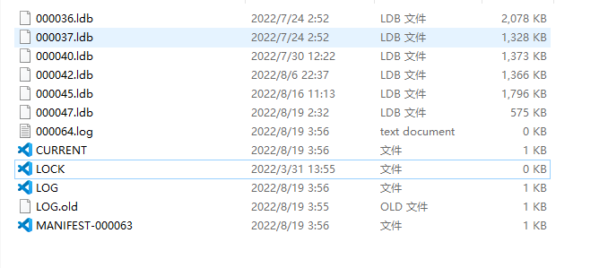
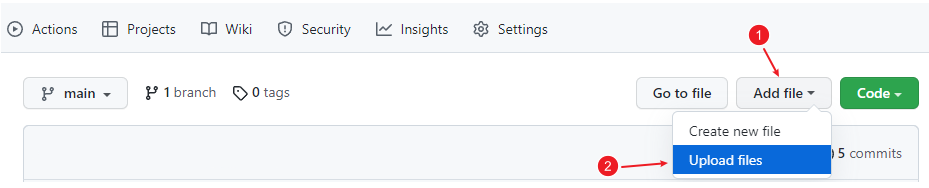
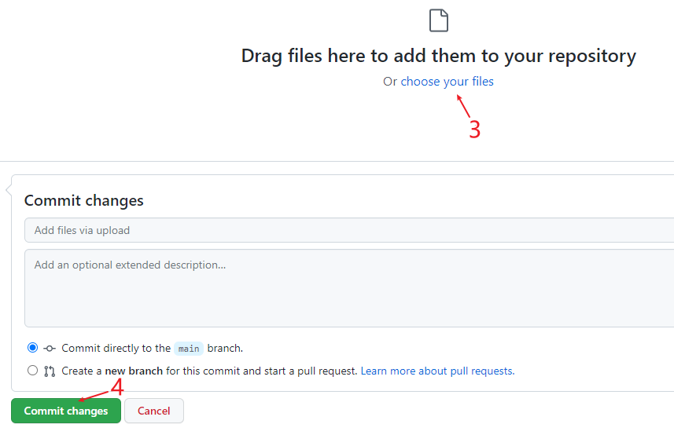
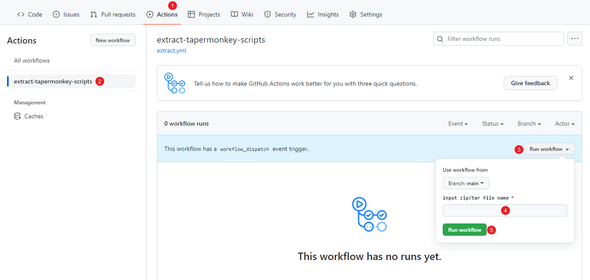
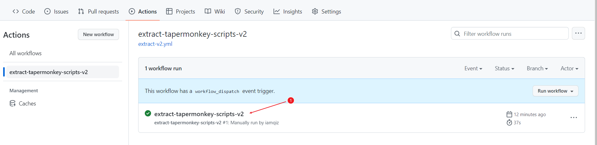
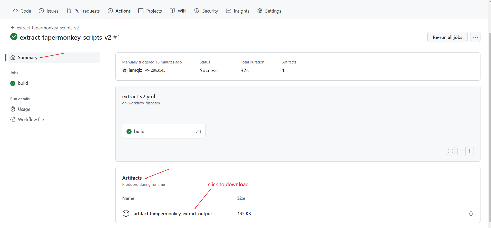

# restore your tapermonkey scripts by github action
[中文文档](README-CN.md)

this repo can restore tapermonkey scripts from its database(chrome leveldb).  
just fork this repo & upload its database to the repo ,and run github action,
then the restored tapermonkey scripts will placed in github action artifact, and you can download it

## how to use?


### 1 pack your tapermonkey database to .zip or .tar  
database path :
```text
# Linux:  "/home/<USERNAME>/.config/<BROWSER>/Default/Local Extension Settings/<EXTENSION_ID>"
# Mac : "/Users/<USERNAME>/Library/Application Support/Google/Chrome/Default/Local Extension Settings/<EXTENSION_ID>/"
#Windows chrome: "C:\Users\<USERNAME>\AppData\Local\Google\Chrome\User Data\Default\Local Extension Settings\<EXTENSION_ID>"
#windows edge:   "C:\Users\<USERNAME>\AppData\Local\Microsoft\Edge\User Data\Default\Local Extension Settings\<EXTENSION_ID>
```
paste chrome://version/ in chrome address bar and enter, you will get your chrome profile data path

the database dir include Manifest-*      CURRENT     *.ldb files and so on.  
a database example:  


details about google leveldb:  
[https://github.com/google/leveldb/blob/main/doc/impl.md](https://github.com/google/leveldb/blob/main/doc/impl.md)

### 2 fork the repository

### 3 upload the .zip or .tar file to the forked repo



### 4 run github action and specify full path of the zip/tar file 



wait a moment until action finish


### 5 download result from github action artifact






